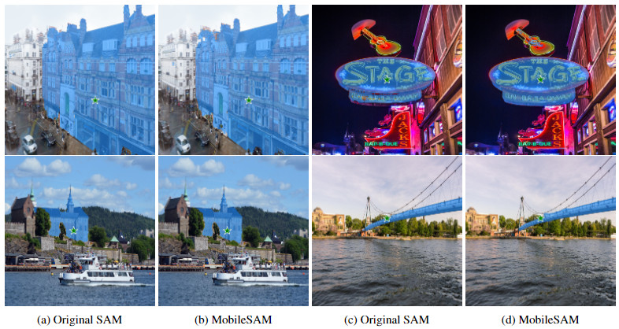
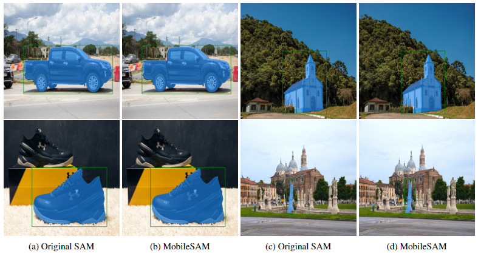

# MobileSAM 学习项目

> **注意**: 本项目是基于 [MobileSAM](https://github.com/ChaoningZhang/MobileSAM) 的学习实现。原始优秀工作由 Chaoning Zhang 等人完成。本仓库仅用于学习目的。

> **原始项目**: 请访问 MobileSAM 原始项目 https://github.com/ChaoningZhang/MobileSAM

<p align="center">
  
</p>

## 项目概述

本仓库包含了我对 MobileSAM (Mobile Segment Anything Model) 的学习实现。MobileSAM 是分割任意物体模型(SAM)的轻量级版本。项目主要聚焦于理解和学习其高效架构，该架构在保持性能的同时实现了更快的推理速度。

学习要点：
- 轻量级 ViT 图像编码器的实现
- 高效的提示引导掩码解码器
- TinyViT 的模型优化集成
- ONNX 模型导出功能

## 环境配置

代码要求：
- Python >= 3.8
- PyTorch >= 1.7
- TorchVision >= 0.8

```bash
# 克隆仓库
git clone https://github.com/[你的用户名]/MobileSAM-Study.git
cd MobileSAM-Study

# 创建 conda 环境
conda create -n mobilesam python=3.8
conda activate mobilesam

# 安装依赖
pip install torch torchvision
pip install -r requirements.txt
```

## 基本使用

以下是模型使用的简单示例：

```python
from mobile_sam import sam_model_registry, SamPredictor

# 加载模型
model_type = "vit_t"
sam_checkpoint = "./weights/mobile_sam.pt"
device = "cuda" if torch.cuda.is_available() else "cpu"

mobile_sam = sam_model_registry[model_type](checkpoint=sam_checkpoint)
mobile_sam.to(device=device)
mobile_sam.eval()

# 创建预测器
predictor = SamPredictor(mobile_sam)

# 设置图像并预测
predictor.set_image(your_image)
masks, _, _ = predictor.predict(your_prompts)
```

## 模型架构分析

模型主要包含两个组件：

1. 图像编码器 (轻量级 ViT)
   - 参数量：5M
   - 推理时间：约 8ms
   - 基于 TinyViT 架构

2. 掩码解码器
   - 参数量：3.876M
   - 推理时间：约 4ms
   - 与原始 SAM 相同的架构

整体性能：
- 总参数量：9.66M
- 总推理时间：约 12ms

<p align="center">
  
</p>

## 实验和学习笔记

在这个学习项目中，我主要关注：
1. 高效架构设计
2. 模型大小和性能之间的权衡
3. 轻量级图像编码器的实现细节
4. 移动端部署的集成策略

主要学习收获：
- 模型优化技术
- 高效实现实践
- 移动端友好的架构考虑
- 性能基准测试方法

## 实验结果展示

使用点提示的分割结果：
<p align="center">
  
</p>

使用框提示的分割结果：
<p align="center">
  
</p>

## 演示应用

本地运行演示：

```bash
cd app
python app.py
```

演示支持：
- 图像上传
- 点和框提示
- 实时分割可视化

## ONNX模型导出

支持导出ONNX格式的模型：

```bash
python scripts/export_onnx_model.py \
    --checkpoint ./weights/mobile_sam.pt \
    --model-type vit_t \
    --output ./mobile_sam.onnx
```

## 参与贡献

虽然这主要是一个学习项目，但欢迎讨论和建议：
- 提出问题或讨论
- 提交改进建议
- 分享学习经验

## 致谢

本学习项目基于以下优秀工作：

- 原始 [MobileSAM](https://github.com/ChaoningZhang/MobileSAM) 项目
- [Segment Anything Model (SAM)](https://github.com/facebookresearch/segment-anything)
- [TinyViT](https://github.com/microsoft/Cream/tree/main/TinyViT)

如果您觉得有帮助，请引用原始工作：

```bibtex
@article{mobile_sam,
  title={Faster Segment Anything: Towards Lightweight SAM for Mobile Applications},
  author={Zhang, Chaoning and Han, Dongshen and Qiao, Yu and Kim, Jung Uk and Bae, Sung-Ho and Lee, Seungkyu and Hong, Choong Seon},
  journal={arXiv preprint arXiv:2306.14289},
  year={2023}
}
```

```bibtex
@article{kirillov2023segany,
  title={Segment Anything}, 
  author={Kirillov, Alexander and Mintun, Eric and Ravi, Nikhila and Mao, Hanzi and Rolland, Chloe and Gustafson, Laura and Xiao, Tete and Whitehead, Spencer and Berg, Alexander C. and Lo, Wan-Yen and Doll{\'a}r, Piotr and Girshick, Ross},
  journal={arXiv:2304.02643},
  year={2023}
}
```

```bibtex
@InProceedings{tiny_vit,
  title={TinyViT: Fast Pretraining Distillation for Small Vision Transformers},
  author={Wu, Kan and Zhang, Jinnian and Peng, Houwen and Liu, Mengchen and Xiao, Bin and Fu, Jianlong and Yuan, Lu},
  booktitle={European conference on computer vision (ECCV)},
  year={2022}
}
```

## 许可证

本项目仅用于学习和教育目的。任何商业用途，请参考原始 [MobileSAM](https://github.com/ChaoningZhang/MobileSAM) 项目及其许可证。
